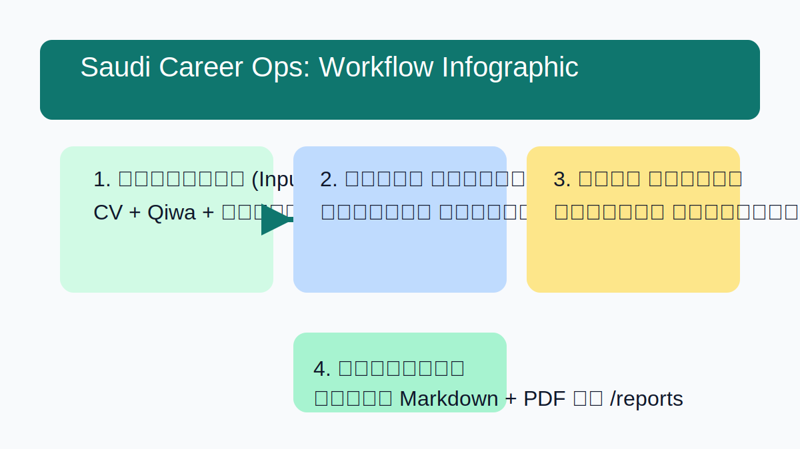
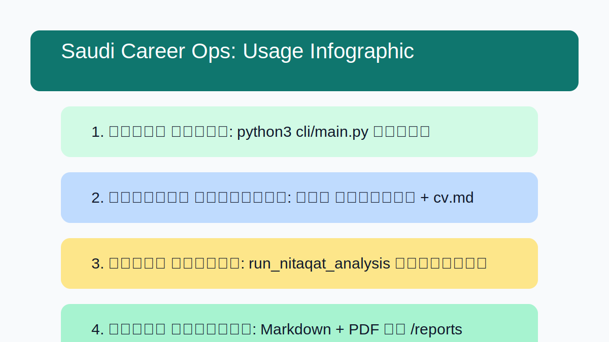

# 🚀 Saudi Career Ops: Intelligence Engine | محرك ذكاء سوق العمل السعودي

An automated intelligent system to streamline career planning and operational efficiency in the Saudi labor market.

## 📂 Project Overview

This project aims to build an independent Inference Engine designed to simplify Saudi labor market complexities (Nitaqat, Qiwa, Special Economic Zones). The system generates context-aware, automated professional consultation reports.

## 🏗️ Architecture & Workflow

The system features a modular Python core (Nitaqat Engine) integrated into a CLI tool, facilitating automatic Markdown reporting and local archiving.

## 2. الاستخدام المؤتمت (Automated Integration)

عندما يطلب المستخدم تقييم وظيفة (وظيفة):

- تحليل معطيات إعلان الوظيفة.
- استدعاء دالة `run_nitaqat_analysis` تلقائياً.
- عرض ملخص التقييم للمستخدم في المحادثة، وإخباره بوجود تقرير مفصل في مجلد `/reports`.

## 🗺️ خارطة الطريق

### المرحلة 2 (مكتمل) ✅

- [x] إطلاق محرك تقييم "نطاقات" (Nitaqat Engine).
- [x] تفعيل نظام التنبيهات والتحذيرات (Warning System).
- [x] أتمتة تصدير التقارير الاستشارية (Automated Reporting).

### المرحلة 3 (جاري العمل) 🔄

- [ ] الربط الكامل لمحرك التقييم عبر `main.py` (Integration).
- [ ] إضافة قاعدة بيانات المنشآت الحقيقية (`entities_db.tsv`).
- [ ] تحويل الأداة إلى تطبيق ويب بسيط (Web UI).

## 🖼️ Usage Infographic

## ⚖️ Disclaimer

**النسخة العربية:** هذا المشروع هو أداة استشارية أولية للأغراض التعليمية والمعلوماتية فقط. لا يعتبر النظام بأي حال من الأحوال مصدراً رسمياً أو ملزماً لقرارات التوطين أو التوظيف. لتطبيق القوانين، يرجى دائماً مراجعة وزارة الموارد البشرية والتنمية الاجتماعية والمنصات الرسمية مثل "قوى".

**English Version:** This project is a preliminary advisory tool for educational and informational purposes only. It is not an official source for Saudization or employment decisions. For regulatory compliance, always consult the Ministry of Human Resources and Social Development and official platforms like "Qiwa."

## 📜 رخصة الاستخدام (License)

This project is licensed under the MIT License.

## Contributing

We welcome contributions! Please refer to our `CONTRIBUTING.md` for guidelines on how to contribute to the engine, data, or documentation.
